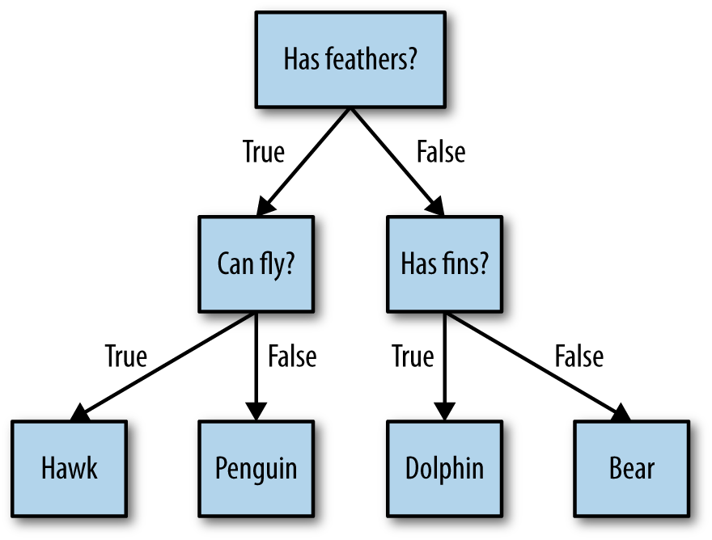

Decision Trees are widely used models for classification as well as regression tasks. In this approach in order to distinguish between certain class a series of if/else questions are asked and based on the answers the items are classified.

