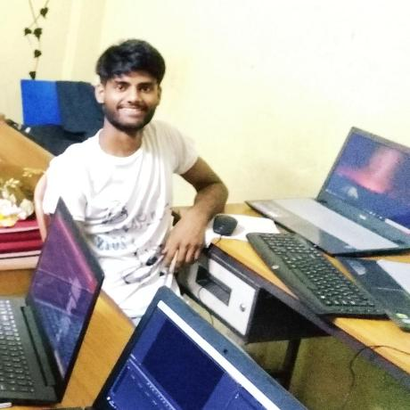

## About
Hi There !!!.I am Vikas Kumar ,currently studying in National Institute of Technology,Arunachal Pradesh pursuing my Bachelor Degree in Computer Science(B.Tech).I am a Machine Learning & Artificial Intelligence enthusiast who likes to work on the real life implementation of it.I am a Free Open Source Software(FOSS) contributor/supporter and very much fascinated towards autonomous vehicles, as a result, I got interested in deep learning. I have worked on several projects, some of them are:
- `Face recognition (HoG detection)on Raspberry Pi`[link](https://github.com/vikaskumareinstein/facial-recognition/)  (Computer Vision , Machine Learning)
- `QR Code Scanning using Camera Module (Rpi)`[link](https://github.com/vikaskumareinstein/facial-recognition/) (Computer Vision, pyzbar-python)
- `Wind Speed Prediction`  (Time Series Forecasting, Machine Learning >>*Will be published soon*)
- `Model Pruning: Traffic Signal Classification Dataset`  (Tensorflow, OpenCV)
- `Autonomous Drone Flight Controller`  (Drones, Autonomous flight *WIP* )
- `Divorce Prediction`  (Machine Learning, Data Mining  >>*Will be published soon*)
- `Automatic COVID-19 detection using Chest X-ray`  (Deep Learning, Computer Vision >>*submitted at elsevier*)
- `Brain Tumor Segmentation`   (Deep Learning)

For further details on the work, please visit the [repository on Github](https://github.com/vikaskumareinstein/).

### **Skills**
I have relevant experience in these:
>**Programming Languages:**
>>*Java*  
>>*Python*  
>>*C++*  
>>*C*   
>>*JavaScript*

>**Subjects / Electives:**
>>*Data Structure*   
>>*Algorithms*  
>>*Database Management System*  
>>*Computer Networking*  
>>*Artificial Intelligence and Neural Networks*  
>>*Deep Learning*  
>>*Linux*  
>>*Computer Vision*

>**Miscellaneous**
>>*Git/Github* 
>>*Raspberry Pi*  
>>*Web Development* 
>>*Android Development*   

### **Conference and Workshops Attended:**

>**Workshop on Data Science** 
Organized by Vision Cog and NIT Arunachal Pradesh 
Aug 2020

>**Idea Generation,Creative Thinking and IPR** 
Organized by APSCST,Govt. of Arunachal Pradesh, NIT Arunachal Pradesh
Sep 2019

>**Augmented Reality** 
Organized by Infi-Zeal and NIT Arunachal Pradesh
Oct 2018

>**Blockchain Technology**
Organized by NIT Arunachal Pradesh
Feb 2020

>**Large Scale Least Squares Twin SVMs by M. Tanveer**
Organized by SHRI VAISHNAV VIDYAPEETH VISHWAVIDYALAYA, INDORE
Aug 2020

### Social Presence:

>[Linkedin Profile](https://www.linkedin.com/in/vikas-kumar-019a7a16a/ ) 
>[Github Profile](https://www.github.com/vikaskumareinstein ) 
>[Twitter](twitter.com/vikaskumareinst)

Recently, I am enjoying learning the application of Machine Learning and Deep Learning in the field of Robotics. In case of any query feel free to drop a mail to: [vikaskumareinstein@gmail.com](vikaskumareinstein@gmail.com)

Last but not least: the [Jekyll documentation](http://jekyllrb.com) is the best starting point!

Enjoy!
